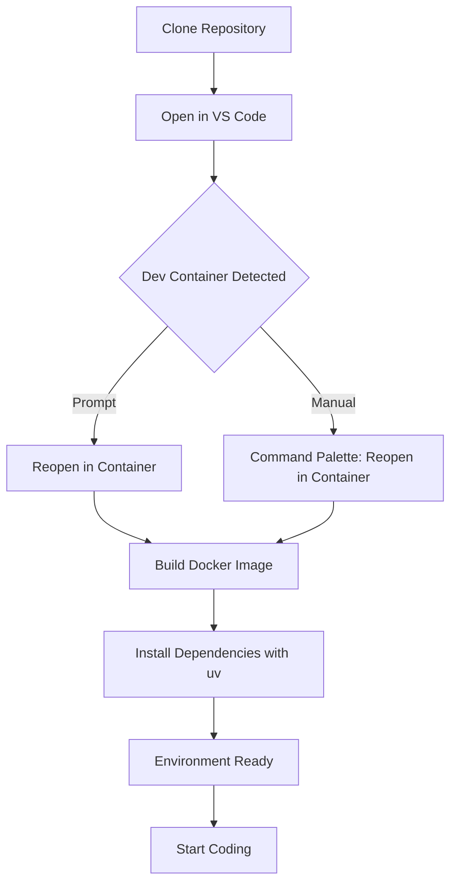

# VS Code Dev Container Template

This repository provides a template for setting up a reproducible development environment using Visual Studio Code's Dev Containers. It includes configurations for a Python project managed with `uv`, a modern Python dependency and project manager.

## Why Use a Dev Container?

A Dev Container ensures a consistent, isolated, and portable development environment. Here’s why it’s important:

- **Consistency**: Every developer gets the same tools, dependencies, and configurations, eliminating "it works on my machine" issues.
- **Isolation**: Dependencies are sandboxed, preventing conflicts with other projects or system-wide packages.
- **Portability**: The environment can be shared and reproduced across machines, clouds, or CI/CD pipelines.
- **Speed**: Pre-configured containers reduce setup time, letting you focus on coding.
- **Security**: Containers limit exposure to system-level vulnerabilities by running in an isolated environment.

For this project, the Dev Container includes Python 3.12, `uv` for dependency management, and a pre-configured VS Code setup.

## Prerequisites

Before setting up the Dev Container, ensure you have:

- [Docker](https://www.docker.com/get-started/) installed and running.
- [Visual Studio Code](https://code.visualstudio.com/) installed.
- The [Dev Containers extension](https://marketplace.visualstudio.com/items?itemName=ms-vscode-remote.remote-containers) for VS Code.
- Git installed to clone this repository.

## Setup Process

Follow these steps to set up the Dev Container:

1. **Clone the Repository**:

    ```bash
    git clone https://github.com/your-username/vscode_devcontainer_template.git
    cd vscode_devcontainer_template
    ```

2. **Open in VS Code**:

    ```bash
    code .
    ```

3. **Reopen in Container**:

    - VS Code will detect the `.devcontainer/devcontainer.json` file and prompt you to "Reopen in Container." Click the prompt, or:
    - Open the Command Palette (Ctrl+Shift+P or Cmd+Shift+P).
    - Select `Dev Containers: Reopen in Container`.

4. **Wait for Container Setup**:

    - The Docker image will be built based on `.devcontainer/Dockerfile`.
    - Dependencies specified in `pyproject.toml` will be installed using `uv sync`.
    - VS Code extensions (if any) will be installed inside the container.

5. **Start Coding**:

    - Once the container is ready, you’re in a fully configured environment with Python 3.12 and your project dependencies.
    - Run scripts with `uv run python your_script.py` to use the isolated environment.

## Setup Flowchart

The following Mermaid diagram illustrates the Dev Container setup process:



## Project Structure

Key files and directories in this template:

- `.devcontainer/`:
  - `devcontainer.json`: Configures the Dev Container, including Docker image and VS Code settings.
  - `Dockerfile`: Defines the container’s base image and setup steps.
  - `docker-compose.yml`: Configures services like databases or volumes.
- `.env` and `.env.example`: Environment variable configurations.
- `pyproject.toml`: Declares project dependencies and metadata, managed by uv.
- `uv.lock`: Ensures reproducible dependency versions.
- `.python-version`: Specifies Python 3.12 for consistency.
- `.gitignore`: Excludes files like `.venv` and `.env` from version control.

## Managing Dependencies

This project uses `uv` for Python dependency management. Here are some common `uv` commands:

- **Create a new project**:

    ```bash
    uv init --python 3.12  # Or just: uv init
    ```

    *(Omitting the version defaults to the system's main Python.)*

- **Add a package**:

    ```bash
    uv add <package>  # e.g., uv add flask
    ```

- **Add from a requirements.txt file**:

    ```bash
    uv add -r requirements.txt
    ```

- **Sync dependencies**:

    ```bash
    uv sync
    ```

- **Run a script**:

    ```bash
    uv run python your_script.py
    ```

- **Show information about a package**:

    ```bash
    uv pip show <package>
    ```

## Excluding Directories

To list files while ignoring `.venv` and `.git` (e.g., for auditing), use:

```bash
find . -path "./.venv" -prune -o -path "./.git" -prune -o -print
```

## Troubleshooting

- **Docker not running?** Ensure Docker Desktop is active or start the Docker daemon.
- **Build errors?** Check `.devcontainer/Dockerfile` for syntax issues or missing dependencies.
- **Dependencies not installing?** Confirm `uv` is installed and your `pyproject.toml` is valid.

